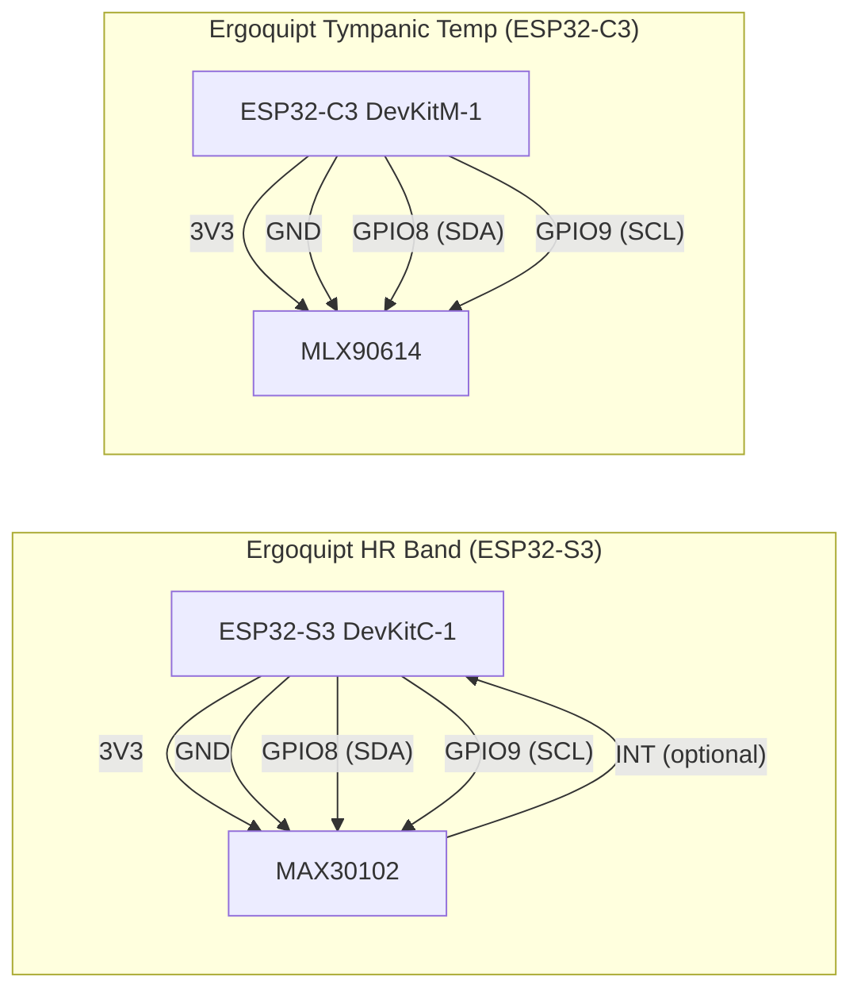
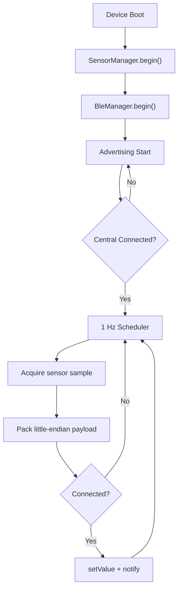
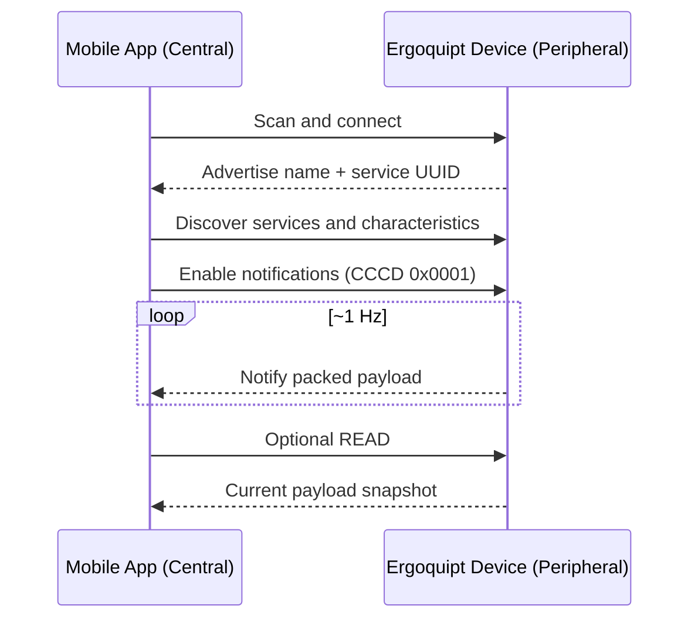

# Ergoquipt BLE Health Ecosystem

Production-oriented dual-device BLE embedded system using PlatformIO + ESP32.

- Device 1: `ergoquipt_hr_band` (ESP32-S3 + MAX30102 integration)
- Device 2: `ergoquipt_tympanic_temp` (ESP32-C3 + MLX90614 placeholder integration)

Both devices are independent BLE Peripherals (GATT Servers).
The mobile app acts as BLE Central.

---

## 1) Repository Structure

```text
.
|-- ergoquipt_hr_band/
|   |-- platformio.ini
|   `-- src/
|       |-- main.cpp
|       |-- ble_manager.cpp
|       |-- ble_manager.h
|       |-- sensor_manager.cpp
|       |-- sensor_manager.h
|       `-- config.h
|-- ergoquipt_tympanic_temp/
|   |-- platformio.ini
|   `-- src/
|       |-- main.cpp
|       |-- ble_manager.cpp
|       |-- ble_manager.h
|       |-- sensor_manager.cpp
|       |-- sensor_manager.h
|       `-- config.h
`-- Ergoquipt_BLE_System_Description.txt
```

---

## 2) Technical Summary

| Item | HR Band | Tympanic Temp |
|---|---|---|
| Board | ESP32-S3 (`esp32-s3-devkitc-1`) | ESP32-C3 (`esp32-c3-devkitm-1`) |
| Framework | Arduino via PlatformIO | Arduino via PlatformIO |
| Sensor | MAX30102 (HR + SpO2 + R-R Interval + HRV RMSSD) | MLX90614 (placeholder/stub in current firmware) |
| Role | BLE Peripheral / GATT Server | BLE Peripheral / GATT Server |
| Characteristic properties | Read + Notify | Read + Notify |
| Security | Bonding + encryption enabled | Bonding + encryption enabled |
| Update rate | 1 Hz | 1 Hz |
| Payload size | 12 bytes | 4 bytes |

---

## 3) Hardware Components (BOM)

### 3.1 HR Band Node

| Component | Qty | Notes |
|---|---:|---|
| ESP32-S3 Dev Board (`esp32-s3-devkitc-1`) | 1 | BLE MCU |
| MAX30102 module | 1 | PPG sensor for HR/SpO2 |
| LiPo battery + charger/protection (optional) | 1 | Portable mode |
| I2C pull-up resistors (if board has none) | 2 | Typical 4.7k to 3.3V |
| Wires / PCB traces | - | Interconnect |

### 3.2 Tympanic Node

| Component | Qty | Notes |
|---|---:|---|
| ESP32-C3 Dev Board (`esp32-c3-devkitm-1`) | 1 | BLE MCU |
| MLX90614 module | 1 | IR temperature sensor |
| LiPo battery + charger/protection (optional) | 1 | Portable mode |
| I2C pull-up resistors (if board has none) | 2 | Typical 4.7k to 3.3V |
| Wires / PCB traces | - | Interconnect |

Notes:
- Keep all logic levels at 3.3V for ESP32 GPIO safety.
- Many breakout boards already include pull-ups; avoid over-pulling the I2C bus.

---

## 4) Pinout and Wiring

Current firmware can use board default I2C mapping. Recommended standardized mapping:

- `SDA = GPIO8`
- `SCL = GPIO9`

If different pins are used, set them in sensor initialization (for example `Wire.begin(SDA, SCL)`).

### 4.1 HR Band Wiring (ESP32-S3 + MAX30102)

| MAX30102 Pin | ESP32-S3 Pin | Description |
|---|---|---|
| VIN | 3V3 | Sensor supply |
| GND | GND | Ground |
| SDA | GPIO8 | I2C data |
| SCL | GPIO9 | I2C clock |
| INT (optional) | Any input GPIO | Optional data-ready interrupt |

### 4.2 Tympanic Wiring (ESP32-C3 + MLX90614)

| MLX90614 Pin | ESP32-C3 Pin | Description |
|---|---|---|
| VIN | 3V3 | Sensor supply |
| GND | GND | Ground |
| SDA | GPIO8 | I2C data |
| SCL | GPIO9 | I2C clock |

### 4.3 Wiring Diagram (Mermaid)



---

## 5) Physiological Metrics (HR Band)

### 5.1 What is R-R Interval?

R-R Interval (also called IBI, Inter-Beat Interval) is the time difference between two consecutive detected heartbeats.

- Unit: milliseconds (ms)
- Used to derive instantaneous heart rhythm timing and heart rate dynamics

### 5.2 What is HRV (RMSSD)?

HRV (RMSSD) is the Root Mean Square of Successive Differences of consecutive R-R intervals.

- RMSSD formula: `sqrt(mean((RRI[n] - RRI[n-1])^2))`
- Common indicator of autonomic nervous system balance
- Useful for stress and fatigue trend analysis

---

## 6) BLE Specification

### 6.1 Device Naming

- HR Band: `Ergoquipt-HR-XXX`
- Tympanic Temp: `Ergoquipt-TEMP-XXX`

`XXX` is derived from the last 3 hex digits of STA MAC (`%01X%02X`).

### 6.2 Service and Characteristic UUIDs

#### HR Band

- Service UUID: `e0020001-7cce-4c2a-9f0b-112233445566`
- Characteristic UUID: `e0020002-7cce-4c2a-9f0b-112233445566`

#### Tympanic Temp

- Service UUID: `e0010001-7cce-4c2a-9f0b-112233445566`
- Characteristic UUID: `e0010002-7cce-4c2a-9f0b-112233445566`

### 6.3 GATT Behavior Contract

- Peripheral role only
- Characteristic properties: `READ | NOTIFY`
- `BLE2902` CCCD descriptor present
- Notify is sent only when connected
- Advertising restarts automatically after disconnect
- Security in firmware:
  - Encryption required
  - Secure bonding enabled (`ESP_LE_AUTH_REQ_SC_BOND`)

---

## 7) BLE API Contract for Mobile Team

This section is the integration contract for Android and iOS developers.

### 7.1 Discovery and Subscription Flow

1. Scan for advertising names:
   - `Ergoquipt-HR-`
   - `Ergoquipt-TEMP-`
2. Connect to device
3. Perform service discovery
4. Locate expected service UUID and characteristic UUID
5. Enable notifications (CCCD write `0x0001`)
6. Optionally perform initial `READ`
7. Consume notification stream at ~1 Hz

### 7.2 Payload Definitions

All multi-byte values are **little-endian**.

#### A) HR Band Payload v2 (12 bytes)

| Byte | Parameter        | Type   | Description |
|------|------------------|--------|-------------|
| 0-1  | Heart Rate       | uint16 | bpm |
| 2-3  | SpO2 x100        | uint16 | `98.50% -> 9850` |
| 4-5  | R-R Interval     | uint16 | milliseconds |
| 6-7  | HRV (RMSSD)      | uint16 | milliseconds |
| 8    | Status           | uint8  | bitmask |
| 9    | Sequence Counter | uint8  | increments each notify |
| 10-11| Reserved         | uint16 | always `0x0000` (future use) |

Decode examples:
- `hr = b0 | (b1 << 8)`
- `spo2 = (b2 | (b3 << 8)) / 100.0`
- `rri = b4 | (b5 << 8)`
- `hrv = b6 | (b7 << 8)`

#### B) Tympanic Temp Payload (4 bytes)

| Byte | Parameter         | Type  | Description |
|------|-------------------|-------|-------------|
| 0-1  | Temperature x100  | int16 | degC x100 |
| 2    | Status            | uint8 | bitmask |
| 3    | Sequence Counter  | uint8 | increments each notify |

Decode examples:
- `tempRaw = int16(b0 | (b1 << 8))`
- `tempC = tempRaw / 100.0`

### 7.3 Status Bitmask Contract

#### HR Band Status (byte 8)

| Bit | Mask | Meaning |
|---:|---:|---|
| 0 | `0x01` | Vitals valid |
| 1 | `0x02` | Sensor error |
| 2 | `0x04` | R-R Interval valid |
| 3 | `0x08` | HRV valid |
| 4 | `0x10` | Low battery |
| 5-7 | - | Reserved |

#### Tympanic Status (byte 2)

| Bit | Mask | Meaning |
|---:|---:|---|
| 0 | `0x01` | Sensor valid |
| 1 | `0x02` | Sensor error |
| 2 | `0x04` | Low battery |
| 3-7 | - | Reserved |

Recommended app behavior:
- Show quality/warning state when sensor error bit is set.
- Treat reserved bits as forward-compatible metadata.
- Validate field-level interpretation using status bits before rendering trends.

### 7.4 Sequence Counter Contract

- Unsigned 8-bit counter increments each published payload.
- Wrap-around behavior is expected (`255 -> 0`).
- Packet loss can be estimated via modulo-256 delta.

Example:
- Last sequence: `250`
- Next sequence: `253`
- Estimated missing packets: `2` (`251`, `252`)

---

## 8) Endianness, Notify Rate, and Architecture

### 8.1 Little Endian Encoding

For all `uint16`/`int16` fields:
- low byte first
- high byte second

Example:
- `payload[n] = value & 0xFF`
- `payload[n+1] = (value >> 8) & 0xFF`

### 8.2 Notify Rate

Both devices target approximately 1 Hz data publication.
Firmware scheduling is millis-based and non-blocking.

### 8.3 Modular Firmware Architecture

HR band:
- `sensor_manager.*`: MAX30102 read, beat detection, RRI, RMSSD HRV, vital status
- `ble_manager.*`: BLE init, payload packing, notify
- `main.cpp`: non-blocking orchestration loop

Tympanic:
- `sensor_manager.*`: temperature sample acquisition and payload encoding
- `ble_manager.*`: BLE init and notify
- `main.cpp`: scheduler and publish loop

---

## 9) Data Flow Diagrams

### 9.1 Runtime Data Flow



### 9.2 BLE Interaction Sequence



---

## 10) Build and Flash

If `platformio` is not available in PATH, use local executable:

### HR Band

```powershell
cd ergoquipt_hr_band
& "C:\Users\UPG - PIU\.platformio\penv\Scripts\platformio.exe" run
```

### Tympanic Temp

```powershell
cd ergoquipt_tympanic_temp
& "C:\Users\UPG - PIU\.platformio\penv\Scripts\platformio.exe" run
```

Upload target:

```powershell
& "C:\Users\UPG - PIU\.platformio\penv\Scripts\platformio.exe" run -t upload
```

---

## 11) Notes and Next Steps

- HR Band currently performs on-device HR/SpO2/RRI/HRV computation using MAX30102 stream.
- Tympanic firmware currently uses MLX90614 placeholder logic and fixed scheduling architecture.
- Recommended next firmware improvements:
  1. Add robust motion artifact rejection for PPG processing.
  2. Replace placeholder battery logic with real ADC-based battery estimation.
  3. Add quality flags and calibration pipeline for long-term wearable use.