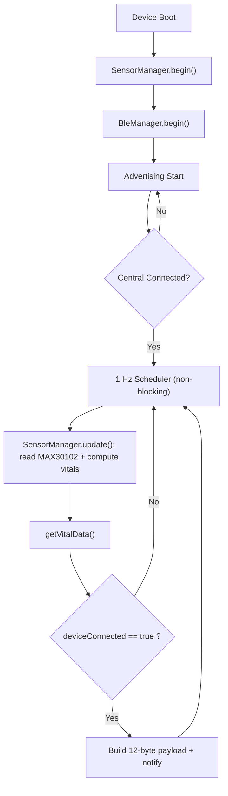
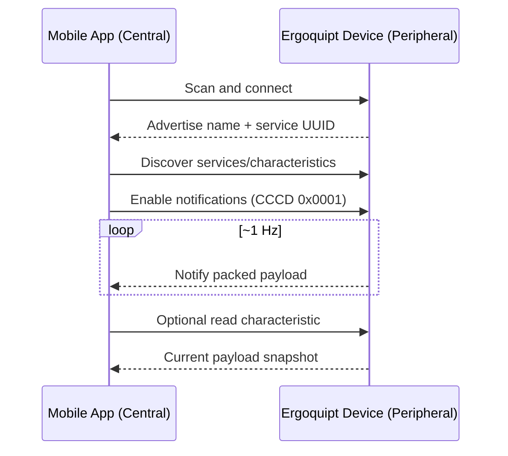

# Ergoquipt BLE Health Ecosystem

Production-oriented dual-device BLE embedded system using PlatformIO + ESP32.

- Device 1: `ergoquipt_hr_band` (ESP32-S3 + MAX30102 integration)
- Device 2: `ergoquipt_tympanic_temp` (ESP32-C3 + MLX90614 placeholder integration)

Both devices are independent BLE Peripherals (GATT Servers).  
The mobile app is BLE Central.

---

## 1) Repository Structure

```text
.
|-- ergoquipt_hr_band/
|   |-- platformio.ini
|   `-- src/
|       |-- main.cpp
|       |-- ble_manager.cpp
|       |-- ble_manager.h
|       |-- sensor_manager.cpp
|       |-- sensor_manager.h
|       `-- config.h
|-- ergoquipt_tympanic_temp/
|   |-- platformio.ini
|   `-- src/
|       |-- main.cpp
|       |-- ble_manager.cpp
|       |-- ble_manager.h
|       |-- sensor_manager.cpp
|       |-- sensor_manager.h
|       `-- config.h
`-- Ergoquipt_BLE_System_Description.txt
```

---

## 2) Technical Summary

| Item | HR Band | Tympanic Temp |
|---|---|---|
| Board | ESP32-S3 (`esp32-s3-devkitc-1`) | ESP32-C3 (`esp32-c3-devkitm-1`) |
| Framework | Arduino via PlatformIO | Arduino via PlatformIO |
| Sensor | MAX30102 (HR + SpO2 + HRV + RR estimation) | MLX90614 (stub placeholder in current code) |
| Role | BLE Peripheral / GATT Server | BLE Peripheral / GATT Server |
| Properties | Read + Notify | Read + Notify |
| Security | Bonding + encryption required | Bonding + encryption required |
| Update interval | 1 Hz | 1 Hz (or trigger event; currently periodic 1 Hz) |
| Payload size | 12 bytes | 4 bytes |

---

## 3) Component List (BOM)

### HR Band Node

| Component | Qty | Notes |
|---|---:|---|
| ESP32-S3 Dev Board (`esp32-s3-devkitc-1`) | 1 | BLE MCU |
| MAX30102 module | 1 | Heart rate + SpO2 sensor (I2C) |
| LiPo battery + charger/protection (optional) | 1 | Portable mode |
| Pull-up resistors for I2C (if sensor board has none) | 2 | Typical 4.7k to 3.3V |
| Jumper wires / PCB traces | - | Wiring |

### Tympanic Node

| Component | Qty | Notes |
|---|---:|---|
| ESP32-C3 Dev Board (`esp32-c3-devkitm-1`) | 1 | BLE MCU |
| MLX90614 module | 1 | IR temperature sensor (I2C) |
| LiPo battery + charger/protection (optional) | 1 | Portable mode |
| Pull-up resistors for I2C (if sensor board has none) | 2 | Typical 4.7k to 3.3V |
| Jumper wires / PCB traces | - | Wiring |

Notes:
- Keep I2C and sensor logic at 3.3V logic level for ESP32 GPIO safety.
- Many breakout boards already include pull-ups; do not duplicate aggressively.

---

## 4) Pinout and Wiring

HR band firmware uses `Wire.begin()` with default board I2C mapping unless overridden.  
Recommended standard pin mapping for both projects:

- `SDA = GPIO8`
- `SCL = GPIO9`

If you choose different pins, set them in sensor init (for example with `Wire.begin(SDA, SCL)` in `sensor_manager`).

### 4.1 HR Band Wiring (ESP32-S3 + MAX30102)

| MAX30102 Pin | ESP32-S3 Pin | Description |
|---|---|---|
| VIN | 3V3 | Sensor supply |
| GND | GND | Ground |
| SDA | GPIO8 | I2C data |
| SCL | GPIO9 | I2C clock |
| INT (optional) | Any input GPIO | Optional interrupt/data-ready |

### 4.2 Tympanic Wiring (ESP32-C3 + MLX90614)

| MLX90614 Pin | ESP32-C3 Pin | Description |
|---|---|---|
| VIN | 3V3 | Sensor supply |
| GND | GND | Ground |
| SDA | GPIO8 | I2C data |
| SCL | GPIO9 | I2C clock |

---

## 5) BLE Specification

### 5.1 Device Naming

- HR Band: `Ergoquipt-HR-XXX`
- Tympanic: `Ergoquipt-TEMP-XXX`

`XXX` is derived from the last 3 hex digits of the STA MAC (`%01X%02X` in current code).

### 5.2 Service and Characteristic UUIDs

#### HR Band

- Service UUID: `e0020001-7cce-4c2a-9f0b-112233445566`
- Characteristic UUID: `e0020002-7cce-4c2a-9f0b-112233445566`

#### Tympanic Temp

- Service UUID: `e0010001-7cce-4c2a-9f0b-112233445566`
- Characteristic UUID: `e0010002-7cce-4c2a-9f0b-112233445566`

### 5.3 GATT Behavior Contract

- Peripheral role only
- Characteristic properties: `READ | NOTIFY`
- CCCD descriptor present (`BLE2902`)
- Notify is sent only when connected
- On disconnect, advertising restarts automatically
- Security mode in firmware:
  - Encryption required
  - Secure bonding enabled (`ESP_LE_AUTH_REQ_SC_BOND`)

---

## 6) BLE API Contract for Mobile App Team

This section is the integration contract for Android/iOS app developers.

### 6.1 Discovery and Subscription Flow

1. Scan for names prefix:
   - `Ergoquipt-HR-`
   - `Ergoquipt-TEMP-`
2. Connect
3. Perform service discovery
4. Find product-specific service UUID and characteristic UUID
5. Enable notifications (write CCCD = `0x0001`)
6. Optionally perform initial `READ` for snapshot
7. Consume notification stream at ~1 Hz

### 6.2 Payload Definitions

All multi-byte fields are **little-endian**.

#### A) HR Band Payload (12 bytes)

| Byte Index | Type | Field | Unit |
|---:|---|---|---|
| 0..1 | `uint16` | `heartRate` | bpm |
| 2..3 | `uint16` | `spo2X100` | SpO2 percent x100 |
| 4..5 | `uint16` | `rrX100` | breaths/min x100 |
| 6..7 | `uint16` | `hrvMs` | ms (RMSSD) |
| 8 | `uint8` | `status` | bitmask |
| 9 | `uint8` | `battery` | 0..100 |
| 10 | `uint8` | `sequence` | wraps 0..255 |
| 11 | `uint8` | `reserved` | always 0 |

Decode:
- `hr = b0 | (b1 << 8)`
- `spo2 = (b2 | (b3 << 8)) / 100.0`
- `rr = (b4 | (b5 << 8)) / 100.0`
- `hrvMs = b6 | (b7 << 8)`

#### B) Tympanic Payload (4 bytes)

| Byte Index | Type | Field | Unit |
|---:|---|---|---|
| 0..1 | `int16` | `temperatureX100` | degC x100 |
| 2 | `uint8` | `status` | bitmask |
| 3 | `uint8` | `sequence` | wraps 0..255 |

Decode:
- `tempRaw = int16(b0 | (b1 << 8))`
- `tempC = tempRaw / 100.0`

### 6.3 HR Band Status Bitmask Contract

| Bit | Mask | Meaning |
|---:|---:|---|
| 0 | `0x01` | HR valid |
| 1 | `0x02` | SpO2 valid |
| 2 | `0x04` | RR valid |
| 3 | `0x08` | HRV valid |
| 4 | `0x10` | Low battery |
| 5 | `0x20` | Sensor error |
| 6..7 | - | Reserved |

Recommended app handling:
- Validate fields using per-metric validity bits before displaying.
- If `sensor error` is set, mark sample invalid and show warning state.
- If `low battery` is set, show battery warning.
- Treat reserved bits as forward-compatible metadata.

### 6.4 Sequence Counter Contract

- 8-bit unsigned counter, increments every published payload.
- Wrap-around is expected: `255 -> 0`.
- App should detect packet drops by computing modulo-256 deltas.

Example:
- Last sequence: `250`
- Next sequence: `253`
- Estimated missing packets: `2` (`251`, `252`)

---

## 7) Data Flow Diagrams

### 7.1 Runtime Data Flow (HR Band)



### 7.2 BLE Interaction Sequence



---

## 8) Build and Flash

Because some setups do not have `pio` in PATH, use:

### HR Band

```powershell
cd ergoquipt_hr_band
& "C:\Users\ASUS TUF\.platformio\penv\Scripts\python.exe" -m platformio run
```

### Tympanic Temp

```powershell
cd ergoquipt_tympanic_temp
& "C:\Users\ASUS TUF\.platformio\penv\Scripts\python.exe" -m platformio run
```

Upload target:

```powershell
& "C:\Users\ASUS TUF\.platformio\penv\Scripts\python.exe" -m platformio run -t upload
```

---

## 9) Implementation Notes and Next Steps

- HR band module currently reads MAX30102 and publishes:
  - HR from beat-to-beat interval
  - SpO2 estimation from AC/DC ratio
  - HRV RMSSD from rolling IBI buffer
  - RR estimation placeholder derived from HRV trend
- Tympanic module remains placeholder/stub based in current code.
- Recommended next firmware step:
  1. Replace RR estimator placeholder with respiration extraction from PPG baseline modulation.
  2. Add real battery ADC measurement and map to `battery` field.
  3. Add sensor-quality index and motion artifact rejection.