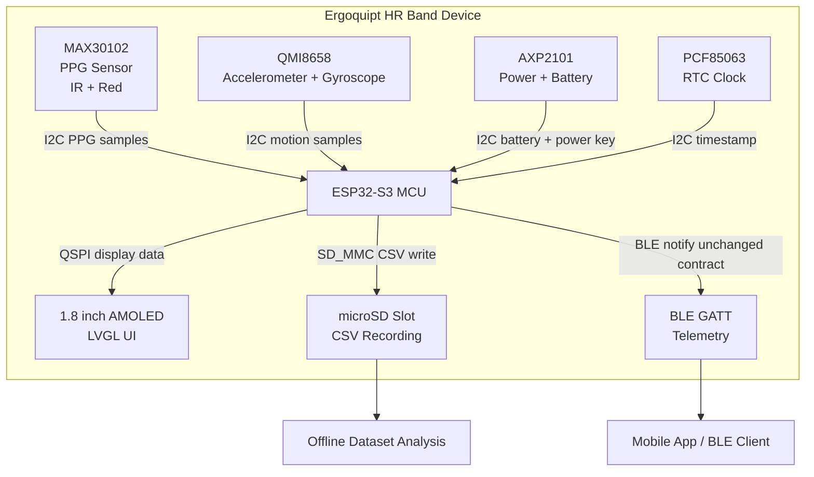
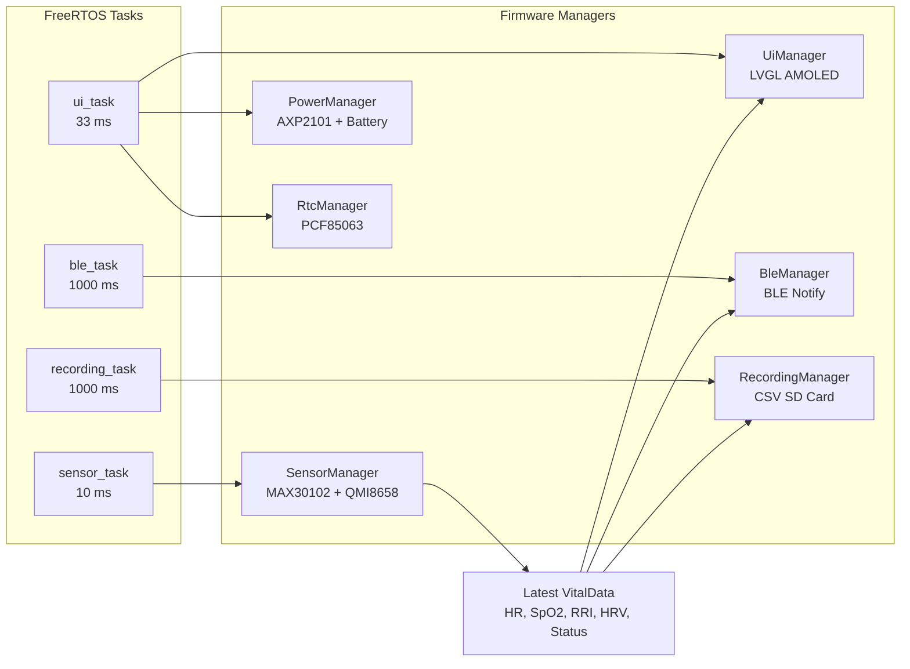
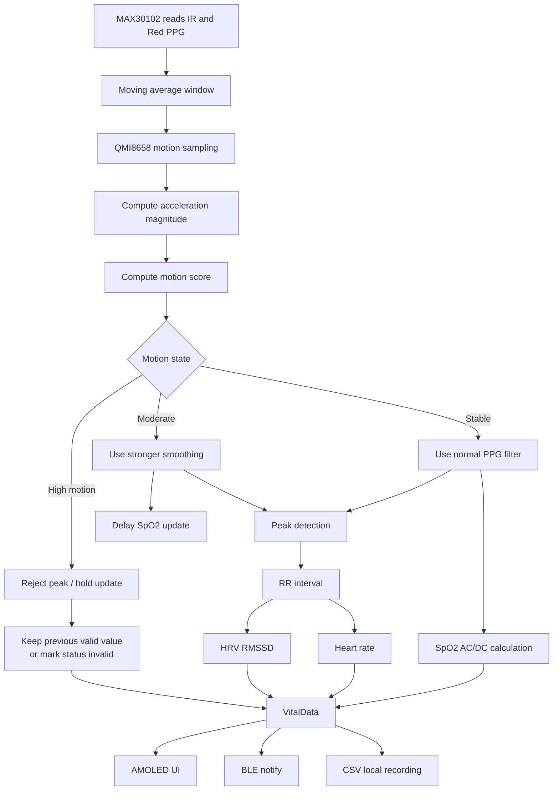
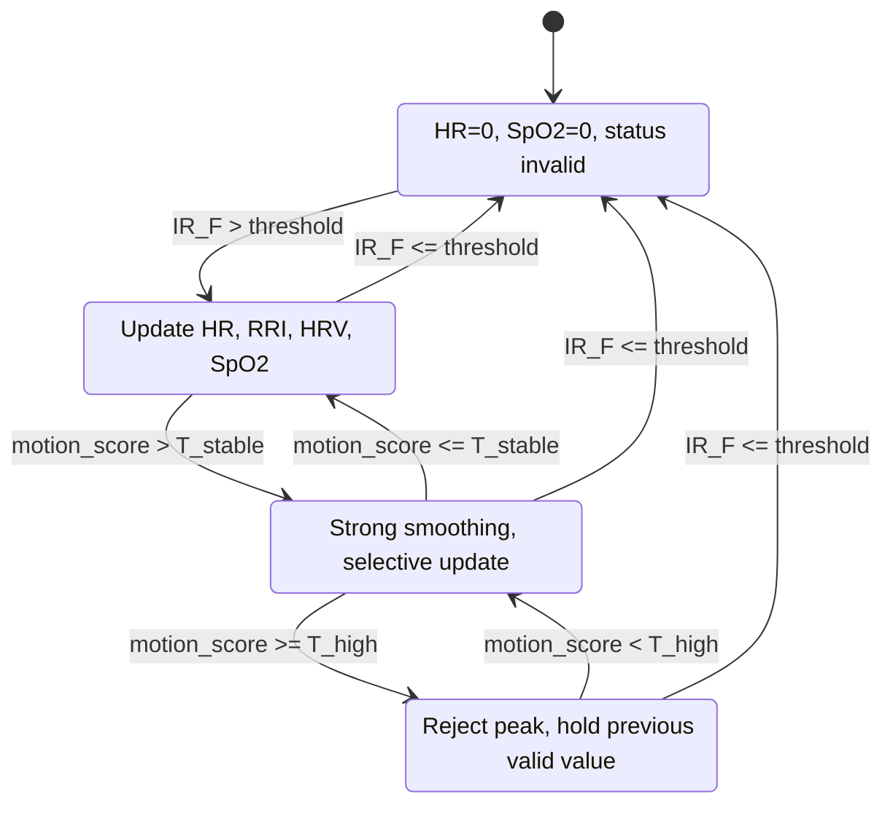
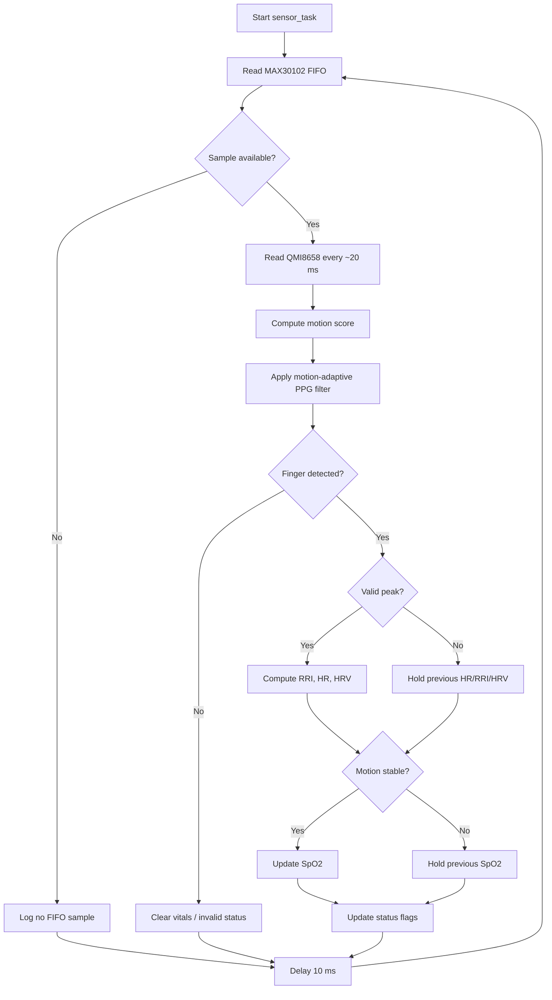
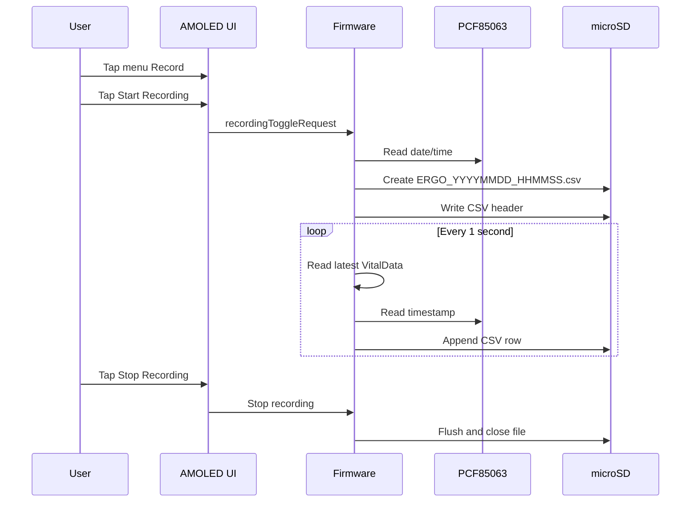
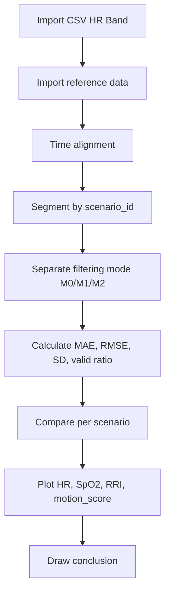
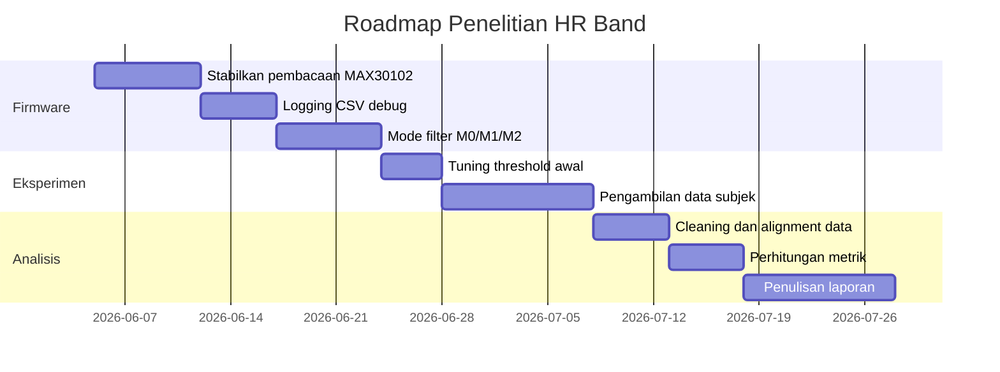

# Rancangan Penelitian HR Band: Filtering Sensor MAX30102 Menggunakan QMI8658

> Catatan preview: diagram menggunakan Mermaid dan formula menggunakan LaTeX/KaTeX. Jika dibuka di VS Code, install **Markdown Preview Mermaid Support** (`bierner.markdown-mermaid`) dan **Markdown+Math** (`goessner.mdmath`) agar diagram serta rumus tampil rapi.

## 1. Judul Penelitian

**Peningkatan Stabilitas Pembacaan Heart Rate, RR Interval, HRV, dan SpO2 pada Wearable HR Band berbasis MAX30102 menggunakan Motion Artifact Filtering dari IMU QMI8658**

Alternatif judul:

1. **Implementasi Motion Artifact Rejection pada Sensor PPG MAX30102 berbasis QMI8658 untuk Wearable Health Monitoring**
2. **Analisis Pengaruh Data IMU terhadap Akurasi Pembacaan Heart Rate dan SpO2 pada Sensor MAX30102**
3. **Rancang Bangun Wearable Heart Rate Monitor dengan Koreksi Artefak Gerak menggunakan Sensor Inersia QMI8658**

## 2. Latar Belakang

Sensor MAX30102 adalah sensor PPG yang umum digunakan untuk mengukur sinyal denyut darah melalui kanal cahaya merah dan inframerah. Pada perangkat wearable berbentuk jam tangan, sinyal PPG sangat rentan terhadap **motion artifact**, yaitu gangguan sinyal akibat pergerakan tangan, perubahan tekanan sensor terhadap kulit, dan perubahan posisi sensor.

Pada HR Band ini, sensor MAX30102 dipadukan dengan IMU QMI8658. IMU tidak digunakan untuk menghitung heart rate secara langsung, tetapi digunakan sebagai sumber informasi gerakan untuk:

- mendeteksi kondisi diam, gerak ringan, dan gerak tinggi;
- mengatur kekuatan filtering pada sinyal PPG;
- menolak peak palsu saat gerakan tinggi;
- menunda pembaruan SpO2 ketika sinyal sedang tidak stabil;
- memberi status kualitas data pada UI, BLE, dan CSV recording.

Dengan pendekatan ini, penelitian tidak hanya membahas pembuatan alat, tetapi juga menguji apakah informasi gerak dari IMU dapat meningkatkan kualitas estimasi parameter fisiologis dari sensor PPG.

## 3. Rumusan Masalah

1. Bagaimana merancang sistem wearable HR Band berbasis MAX30102 dan QMI8658 untuk membaca HR, RR interval, HRV, dan SpO2?
2. Bagaimana memanfaatkan data akselerometer QMI8658 untuk mendeteksi motion artifact pada sinyal PPG?
3. Bagaimana pengaruh filtering berbasis motion score terhadap akurasi dan stabilitas pembacaan MAX30102?
4. Seberapa besar penurunan error pembacaan HR dan SpO2 setelah menggunakan motion-adaptive filtering dibandingkan tanpa filtering berbasis IMU?

## 4. Tujuan Penelitian

1. Merancang dan mengimplementasikan perangkat wearable HR Band berbasis ESP32-S3, MAX30102, QMI8658, AXP2101, PCF85063, BLE, layar AMOLED, dan SD card.
2. Mengembangkan metode filtering berbasis motion score dari QMI8658 untuk mengurangi motion artifact pada sinyal PPG.
3. Mengevaluasi performa pembacaan HR, RR interval, HRV, dan SpO2 pada beberapa kondisi gerakan.
4. Membandingkan hasil pembacaan sebelum dan sesudah filtering menggunakan metrik error kuantitatif.

## 5. Batasan Penelitian

- Penelitian difokuskan pada **motion artifact filtering**, bukan validasi klinis perangkat medis.
- Referensi pembanding dapat menggunakan pulse oximeter komersial atau chest strap heart rate monitor jika tersedia.
- SpO2 dihitung menggunakan pendekatan rasio AC/DC sederhana, bukan algoritma medis tertutup.
- HRV yang digunakan adalah domain waktu sederhana, yaitu **RMSSD** dari RR interval.
- Filtering dilakukan pada level firmware embedded agar dapat berjalan real-time pada ESP32-S3.
- BLE contract tidak diubah; logging tambahan dilakukan melalui SD card CSV.

## 6. Hipotesis

**H1:** Penggunaan motion score dari QMI8658 dapat menurunkan error pembacaan heart rate pada kondisi gerakan tangan dibandingkan pembacaan MAX30102 tanpa filtering berbasis IMU.

**H2:** Motion-adaptive filtering dapat meningkatkan stabilitas RR interval dan HRV dengan menolak peak palsu akibat gerakan.

**H3:** Pembaruan SpO2 hanya pada kondisi motion-stable menghasilkan pembacaan SpO2 yang lebih stabil dibandingkan pembaruan SpO2 terus-menerus saat bergerak.

## 7. Arsitektur Device HR Band

## 8. Arsitektur Firmware

## 9. Alur Data Pengukuran

## 10. Metode Filtering yang Digunakan

Metode yang disarankan adalah **Motion-Adaptive PPG Filtering**. Metode ini memanfaatkan QMI8658 untuk membuat skor gerakan, lalu skor tersebut digunakan untuk mengatur strategi pemrosesan PPG.

> Catatan formula: seluruh rumus ditulis menggunakan LaTeX/KaTeX agar lebih rapi pada Markdown Preview yang mendukung math rendering.

### 10.1 Akuisisi PPG

MAX30102 menghasilkan dua sinyal utama:

- $IR[n]$: sampel inframerah.
- $RED[n]$: sampel merah.

Sinyal awal difilter menggunakan moving average:

$$
IR_{MA}[n] = \frac{1}{N}\sum_{k=0}^{N-1} IR[n-k]
$$

$$
RED_{MA}[n] = \frac{1}{N}\sum_{k=0}^{N-1} RED[n-k]
$$

Dengan:

- $N = 8$ untuk smoothing sinyal pendek.
- $IR_{MA}[n]$ digunakan untuk peak detection.
- $RED_{MA}[n]$ digunakan sebagai bagian dari perhitungan $SpO_2$.

### 10.2 Akuisisi Gerakan QMI8658

Data akselerometer dari QMI8658 dinyatakan sebagai:

$$
a_x[n],\ a_y[n],\ a_z[n]
$$

Magnitude percepatan dihitung dengan:

$$
A[n] = \sqrt{a_x[n]^2 + a_y[n]^2 + a_z[n]^2}
$$

Komponen perubahan gerakan dihitung sebagai selisih magnitude terhadap nilai low-pass sebelumnya:

$$
D[n] = \left|A[n] - A_{LPF}[n-1]\right|
$$

Low-pass magnitude akselerasi:

$$
A_{LPF}[n] = \alpha_a A_{LPF}[n-1] + (1-\alpha_a)A[n]
$$

Pada firmware saat ini:

$$
\alpha_a = 0.90
$$

### 10.3 Motion Score

Motion score dihitung menggunakan exponential moving average terhadap perubahan magnitude:

$$
M[n] = \alpha_m M[n-1] + (1-\alpha_m)D[n]
$$

Pada firmware saat ini:

$$
\alpha_m = 0.85
$$

Interpretasi motion score:

| Kondisi | Syarat | Makna |
|---|---:|---|
| Stable | $M[n] \le 0.08$ | Tangan relatif diam, data PPG dapat dipercaya |
| Moderate motion | $0.08 < M[n] < 0.22$ | Ada gerakan, perlu smoothing lebih kuat |
| High motion | $M[n] \ge 0.22$ | Risiko peak palsu tinggi, peak ditolak |

### 10.4 Motion-Adaptive PPG Filter

Jika kondisi stabil:

$$
IR_F[n] = IR_{MA}[n]
$$

Jika kondisi bergerak:

$$
IR_F[n] = \beta IR_F[n-1] + (1-\beta)IR_{MA}[n]
$$

Pada firmware saat ini:

$$
\beta = 0.75
$$

Makna teknis:

- Pada kondisi diam, filter lebih responsif.
- Pada kondisi bergerak, filter lebih konservatif agar noise gerakan tidak langsung mengubah output.

### 10.5 Baseline Adaptif

Baseline IR digunakan untuk membedakan komponen DC dan perubahan denyut:

$$
B_{IR}[n] = \gamma B_{IR}[n-1] + (1-\gamma)IR_F[n]
$$

Pada firmware saat ini:

$$
\gamma = \frac{31}{32} = 0.96875
$$

Amplitude terhadap baseline:

$$
Amp[n] = \max(IR_F[n] - B_{IR}[n], 0)
$$

### 10.6 Deteksi Peak

Turunan diskrit:

$$
d[n] = IR_F[n] - IR_F[n-1]
$$

Peak kandidat terdeteksi saat:

$$
d[n-1] > 0 \quad \text{dan} \quad d[n] \le 0
$$

Peak diterima jika memenuhi dua kondisi berikut:

$$
Amp[n] > T_{adaptive}
$$

$$
M[n] < T_{high\_motion}
$$

Threshold adaptif:

$$
T_{adaptive} = \max\left(\frac{B_{IR}}{K}, 120\right)
$$

Nilai $K$ ditentukan berdasarkan kondisi gerakan:

$$
K =
\begin{cases}
45, & \text{kondisi stable}\\
32, & \text{kondisi bergerak}
\end{cases}
$$

Karena nilai $K$ lebih kecil menghasilkan threshold lebih besar, peak saat bergerak dibuat lebih sulit diterima.

### 10.7 RR Interval

Jika dua peak valid ditemukan pada waktu $t_i$ dan $t_{i-1}$:

$$
RRI_i = t_i - t_{i-1}
$$

Validasi fisiologis:

$$
300\ \text{ms} \le RRI_i \le 2000\ \text{ms}
$$

Rentang ini ekuivalen dengan:

$$
30\ \text{BPM} \le HR \le 200\ \text{BPM}
$$

### 10.8 Heart Rate

Heart rate dihitung dari rata-rata RR interval:

$$
HR = \frac{60000}{\mathrm{mean}(RRI)}
$$

Dengan $RRI$ dalam millisecond.

### 10.9 HRV RMSSD

HRV menggunakan RMSSD:

$$
RMSSD = \sqrt{\frac{1}{N-1}\sum_{i=2}^{N}(RRI_i - RRI_{i-1})^2}
$$

RMSSD cocok untuk HRV jangka pendek dan dapat dihitung secara real-time pada embedded device.

### 10.10 SpO2

$SpO_2$ dihitung menggunakan ratio-of-ratios dari kanal RED dan IR.

Komponen DC:

$$
IR_{DC} = \mathrm{mean}(IR)
$$

$$
RED_{DC} = \mathrm{mean}(RED)
$$

Komponen AC sederhana:

$$
IR_{AC} = \max(IR) - \min(IR)
$$

$$
RED_{AC} = \max(RED) - \min(RED)
$$

Ratio:

$$
R = \frac{RED_{AC}/RED_{DC}}{IR_{AC}/IR_{DC}}
$$

Estimasi $SpO_2$:

$$
SpO_2 = 110 - 25R
$$

Pembatasan nilai:

$$
70 \le SpO_2 \le 100
$$

Pada metode berbasis QMI8658, pembaruan $SpO_2$ hanya dilakukan saat:

$$
M[n] \le T_{stable}
$$

Tujuannya adalah mencegah update $SpO_2$ ketika sinyal AC/DC sedang rusak akibat gerakan.

## 11. State Machine Kualitas Sinyal

## 12. Flowchart Firmware Pengukuran

## 13. Alur Recording Data CSV

## 14. Desain Eksperimen

### 14.1 Tujuan Eksperimen

Menguji pengaruh filtering berbasis QMI8658 terhadap kualitas pembacaan:

- Heart rate
- RR interval
- HRV RMSSD
- SpO2
- motion score
- validitas status data

### 14.2 Subjek Pengujian

Rekomendasi minimal:

| Parameter | Rencana |
|---|---:|
| Jumlah subjek | 5-10 orang |
| Usia | 18-35 tahun |
| Kondisi | Sehat, tidak sedang aktivitas berat |
| Durasi per skenario | 2-3 menit |
| Posisi sensor | Pergelangan tangan seperti jam tangan |
| Referensi HR | Pulse oximeter / chest strap / smartwatch referensi |
| Referensi SpO2 | Pulse oximeter jari |

Jika keterbatasan alat referensi, penelitian tetap bisa dilakukan sebagai **analisis stabilitas sinyal**, tetapi kesimpulan akurasi harus dibatasi.

### 14.3 Variabel Penelitian

| Jenis Variabel | Variabel | Keterangan |
|---|---|---|
| Variabel bebas | Kondisi gerakan tangan | Diam, ringan, sedang, tinggi |
| Variabel bebas | Metode filtering | Tanpa IMU vs dengan IMU |
| Variabel terikat | Error HR | Selisih HR alat terhadap referensi |
| Variabel terikat | Error SpO2 | Selisih SpO2 alat terhadap referensi |
| Variabel terikat | Stabilitas RRI | Variansi atau standar deviasi RRI |
| Variabel terikat | Stabilitas HRV | Perubahan RMSSD antar window |
| Variabel kontrol | Posisi alat | Dipasang pada lokasi yang sama |
| Variabel kontrol | Durasi uji | Sama untuk semua skenario |
| Variabel kontrol | Sampling | Konfigurasi MAX30102 dan QMI8658 sama |

### 14.4 Skenario Percobaan

| Kode | Skenario | Deskripsi Gerakan | Durasi | Tujuan |
|---|---|---|---:|---|
| S1 | Diam | Tangan diam di meja | 180 s | Baseline kualitas sinyal |
| S2 | Gerak ringan | Pergelangan bergerak perlahan | 180 s | Uji toleransi gerak kecil |
| S3 | Gerak sedang | Ayunan tangan seperti berjalan | 180 s | Uji motion artifact umum |
| S4 | Gerak tinggi | Gerakan acak/cepat pada pergelangan | 180 s | Uji kemampuan reject peak |
| S5 | Transisi | 60 s diam, 60 s gerak, 60 s diam | 180 s | Uji recovery setelah motion |
| S6 | Tekanan berubah | Strap agak longgar vs kencang | 180 s | Uji pengaruh kontak sensor |

### 14.5 Protokol Pengambilan Data

1. Pasang HR Band pada pergelangan tangan subjek.
2. Pasang alat referensi, misalnya oximeter jari atau chest strap.
3. Sinkronkan waktu pencatatan, minimal menggunakan timestamp RTC pada HR Band.
4. Masuk ke menu **Record** pada layar HR Band.
5. Tekan **Start Recording** untuk menyimpan CSV ke microSD.
6. Jalankan skenario sesuai urutan.
7. Catat nilai referensi setiap 5 atau 10 detik, atau gunakan alat referensi yang dapat logging otomatis.
8. Tekan **Stop Recording** setelah skenario selesai.
9. Ulangi untuk semua skenario dan semua subjek.

## 15. Format Data yang Diambil

### 15.1 Data Utama dari HR Band

CSV firmware saat ini mencatat kolom eksperimen berikut:

| Kolom | Satuan | Keterangan |
|---|---:|---|
| `millis` | ms | Waktu sistem sejak boot |
| `date` | YYYY-MM-DD | Tanggal dari RTC |
| `time` | HH:MM:SS | Jam dari RTC |
| `filter_mode` | M0/M1/M2/M3 | Mode filtering aktif saat baris direkam |
| `hr` | BPM | Heart rate hasil olah PPG |
| `spo2_x100` | % x 100 | SpO2, contoh 9750 berarti 97.50% |
| `rri` | ms | RR interval antar peak |
| `hrv` | ms | HRV RMSSD |
| `status` | bitmask | Status validitas data firmware |
| `battery_pct` | % | Persentase baterai dari AXP2101 |
| `ble_connected` | 0/1 | Status koneksi BLE |
| `ir_raw` | ADC count | Sinyal IR mentah MAX30102 |
| `red_raw` | ADC count | Sinyal RED mentah MAX30102 |
| `ir_filtered` | ADC count | Sinyal IR setelah filtering sesuai mode |
| `acc_x` | g | Akselerasi sumbu X QMI8658 |
| `acc_y` | g | Akselerasi sumbu Y QMI8658 |
| `acc_z` | g | Akselerasi sumbu Z QMI8658 |
| `acc_mag` | g | Magnitude akselerasi |
| `motion_score` | g delta | Skor motion artifact |
| `motion_state` | class | `stable`, `moderate`, atau `high` |
| `imu_ready` | 0/1 | Status QMI8658 terdeteksi |
| `finger_present` | 0/1 | Status kontak/jari pada MAX30102 |
| `peak_detected` | 0/1 | Penanda peak valid pada sampel terbaru |
| `rri_accepted` | 0/1 | Penanda peak menghasilkan RRI fisiologis dan update BPM |

Mode filtering dapat dipilih dari menu **Record** pada layar tanpa upload firmware ulang. BLE contract tetap tidak berubah; penambahan kolom hanya berlaku pada CSV lokal di SD card.

### 15.2 Template Tabel Dataset Eksperimen

| subject_id | scenario_id | timestamp | hr_band | hr_ref | spo2_band | spo2_ref | rri | hrv | motion_score | motion_state | status |
|---|---|---|---:|---:|---:|---:|---:|---:|---:|---|---:|
| S01 | S1 | 2026-06-05 10:00:01 | 72 | 73 | 98.0 | 98 | 833 | 32 | 0.021 | Stable | 0x0D |
| S01 | S2 | 2026-06-05 10:03:01 | 75 | 74 | 97.5 | 98 | 810 | 35 | 0.092 | Moderate | 0x0D |
| S01 | S4 | 2026-06-05 10:09:01 | 0 | 78 | 0 | 98 | 0 | 0 | 0.310 | High | 0x00 |

## 16. Perbandingan Metode Filtering

Eksperimen sebaiknya membandingkan minimal tiga mode:

| Mode | Nama | Deskripsi |
|---|---|---|
| M0 | No IMU Filtering | PPG moving average dan peak detection tanpa informasi QMI8658 |
| M1 | Motion Gating | Peak ditolak saat motion score tinggi |
| M2 | Motion-Adaptive Filtering | Smoothing diperkuat saat bergerak, peak gating, SpO2 update saat stabil |

Jika waktu penelitian cukup, dapat ditambahkan:

| Mode | Nama | Deskripsi |
|---|---|---|
| M3 | Adaptive Noise Cancellation | Menggunakan magnitude akselerasi sebagai referensi noise untuk filter adaptif |

### 16.1 Optional: NLMS Adaptive Filter

Jika ingin penelitian lebih kuat secara pemrosesan sinyal, dapat diuji metode **Normalized Least Mean Square (NLMS)**.

Sinyal PPG mentah dimodelkan sebagai:

$$
x[n] = s[n] + v[n]
$$

Dengan:

- $s[n]$: sinyal denyut darah yang diinginkan.
- $v[n]$: noise akibat gerakan.

Referensi noise dari IMU:

$$
u[n] = A[n] - A_{LPF}[n]
$$

Output estimasi noise dari adaptive filter:

$$
y[n] = \mathbf{w}^{T}[n]\mathbf{u}[n]
$$

Estimasi sinyal PPG bersih:

$$
e[n] = x[n] - y[n]
$$

Update bobot NLMS:

$$
\mathbf{w}[n+1] = \mathbf{w}[n] + \mu \frac{e[n]\mathbf{u}[n]}{\varepsilon + \lVert\mathbf{u}[n]\rVert^2}
$$

Dengan:

- $\mu$: step size, misalnya 0.01 sampai 0.1.
- $\varepsilon$: konstanta kecil untuk mencegah pembagian nol.
- $\mathbf{u}[n]$: vektor beberapa sampel IMU terakhir.
- $\mathbf{w}[n]$: vektor bobot adaptive filter.

Catatan: NLMS lebih kompleks dan perlu tuning. Untuk S1, metode M2 sudah cukup kuat dan realistis untuk embedded firmware.

## 17. Metrik Evaluasi

### 17.1 Mean Absolute Error

$$
MAE = \frac{1}{N}\sum_{i=1}^{N}\left|y_i - \hat{y}_i\right|
$$

Digunakan untuk HR dan $SpO_2$.

### 17.2 Root Mean Square Error

$$
RMSE = \sqrt{\frac{1}{N}\sum_{i=1}^{N}(y_i - \hat{y}_i)^2}
$$

RMSE lebih sensitif terhadap error besar akibat motion artifact.

### 17.3 Mean Absolute Percentage Error

$$
MAPE = \frac{100\%}{N}\sum_{i=1}^{N}\left|\frac{y_i - \hat{y}_i}{y_i}\right|
$$

MAPE cocok untuk HR, tetapi kurang ideal untuk nilai yang dapat mendekati nol.

### 17.4 Standard Deviation

$$
SD = \sqrt{\frac{1}{N-1}\sum_{i=1}^{N}(x_i - \bar{x})^2}
$$

Digunakan untuk mengukur stabilitas HR, RRI, dan $SpO_2$.

### 17.5 Valid Data Ratio

$$
Valid\ Ratio = \frac{N_{valid}}{N_{total}}
$$

Metrik ini penting karena filter yang terlalu agresif mungkin menurunkan error tetapi terlalu banyak membuang data.

### 17.6 Recovery Time

$$
Recovery\ Time = t_{valid\_after\_motion} - t_{motion\_end}
$$

Digunakan pada skenario transisi untuk mengukur seberapa cepat sistem kembali stabil setelah gerakan berhenti.

## 18. Rencana Analisis Data

Analisis per skenario:

| Analisis | Output |
|---|---|
| HR error per skenario | MAE/RMSE HR pada S1-S6 |
| SpO2 error per skenario | MAE/RMSE SpO2 pada S1-S6 |
| Stabilitas RRI | SD RRI sebelum vs sesudah filtering |
| Stabilitas HRV | Perubahan RMSSD antar kondisi |
| Hubungan motion score dan error | Korelasi motion score terhadap error HR |
| Valid data ratio | Persentase data yang tetap valid |
| Recovery time | Waktu pemulihan setelah gerakan |

## 19. Tabel Hasil yang Diharapkan

### 19.1 Ringkasan Error HR

| Scenario | Mode | MAE HR | RMSE HR | SD HR | Valid Ratio |
|---|---|---:|---:|---:|---:|
| S1 | M0 |  |  |  |  |
| S1 | M2 |  |  |  |  |
| S2 | M0 |  |  |  |  |
| S2 | M2 |  |  |  |  |
| S3 | M0 |  |  |  |  |
| S3 | M2 |  |  |  |  |
| S4 | M0 |  |  |  |  |
| S4 | M2 |  |  |  |  |

### 19.2 Ringkasan Error SpO2

| Scenario | Mode | MAE SpO2 | RMSE SpO2 | SD SpO2 | Valid Ratio |
|---|---|---:|---:|---:|---:|
| S1 | M0 |  |  |  |  |
| S1 | M2 |  |  |  |  |
| S2 | M0 |  |  |  |  |
| S2 | M2 |  |  |  |  |
| S3 | M0 |  |  |  |  |
| S3 | M2 |  |  |  |  |
| S4 | M0 |  |  |  |  |
| S4 | M2 |  |  |  |  |

### 19.3 Hubungan Motion Score terhadap Error

| Motion State | Motion Score Range | Mean HR Error | Mean SpO2 Error | Valid Ratio |
|---|---:|---:|---:|---:|
| Stable | `<= 0.08` |  |  |  |
| Moderate | `0.08 - 0.22` |  |  |  |
| High | `>= 0.22` |  |  |  |

## 20. Kriteria Keberhasilan

Penelitian dianggap berhasil jika:

1. HR Band dapat merekam data HR, SpO2, RRI, HRV, battery, BLE status, dan timestamp ke CSV.
2. QMI8658 berhasil menghasilkan motion score yang berubah sesuai kondisi gerakan.
3. Mode filtering berbasis IMU menurunkan MAE/RMSE HR pada skenario gerakan dibandingkan mode tanpa IMU.
4. Mode filtering berbasis IMU menurunkan variasi RRI palsu pada kondisi gerakan.
5. Sistem tetap berjalan real-time tanpa mengubah kontrak BLE yang sudah ada.

## 21. Risiko dan Mitigasi

| Risiko | Dampak | Mitigasi |
|---|---|---|
| Strap longgar | PPG tidak stabil | Gunakan posisi pemasangan konsisten |
| Sensor tidak menempel rata | IR rendah dan peak hilang | Tambahkan indikator finger/contact quality |
| Referensi tidak logging otomatis | Sinkronisasi data sulit | Catat referensi tiap 5-10 detik dengan timestamp |
| Gerakan tidak konsisten antar subjek | Variansi tinggi | Gunakan instruksi gerakan yang sama |
| Threshold motion tidak cocok | Terlalu banyak data ditolak | Lakukan tuning awal threshold |
| SpO2 wrist PPG kurang akurat | Error SpO2 tinggi | Tekankan penelitian pada stabilitas dan motion artifact, bukan klaim klinis |

## 22. Roadmap Implementasi Penelitian

## 23. Kesimpulan Rancangan

Arah penelitian yang paling tepat untuk alat ini adalah **motion artifact detection dan motion-adaptive filtering pada sinyal PPG wearable**. MAX30102 menyediakan sinyal fisiologis, sedangkan QMI8658 menyediakan konteks gerakan. Kombinasi keduanya memungkinkan sistem membedakan sinyal denyut yang valid dari gangguan akibat gerakan tangan.

Kontribusi utama penelitian:

- desain HR Band wearable berbasis ESP32-S3;
- integrasi MAX30102 dan QMI8658 untuk pembacaan PPG berbasis gerakan;
- metode motion score untuk klasifikasi kualitas sinyal;
- filtering adaptif untuk HR, RR interval, HRV, dan SpO2;
- logging CSV lokal untuk dataset eksperimen;
- evaluasi kuantitatif menggunakan MAE, RMSE, standar deviasi, valid ratio, dan recovery time.
